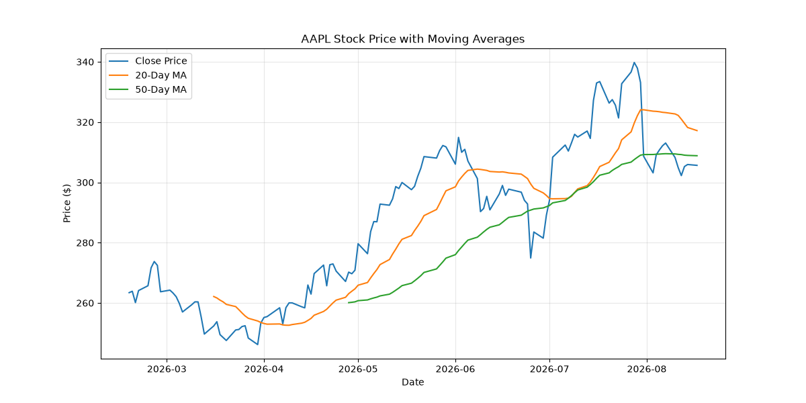

# Stock Market Data Analyzer

A Python-based financial analysis tool that pulls live market data via API, calculates risk/return metrics across multiple stocks, backtests a rule based trading strategy, and stores results in a SQL database.

## What This Project Does

- Fetches live 6 month price history for multiple stocks (AAPL, MSFT, TSLA, GOOGL) using the Yahoo Finance API
- Calculates 20 day and 50 day moving averages, daily returns, volatility, and Sharpe Ratio (risk adjusted return) for each stock
- Backtests a moving average crossover trading strategy against simple buy and hold, correctly accounting for lookahead bias
- Stores all data in a SQLite database and runs SQL aggregate queries against it
- Generates a comparison chart of all four stocks' price movement over the period

## Skills Demonstrated

- **Python**: pandas for data manipulation, functions and loops for scalable multi asset analysis
- **API Integration**: live data retrieval via yfinance
- **SQL**: table creation, safe data insertion, and aggregate queries (AVG, GROUP BY) using sqlite3
- **Financial Modeling**: return/volatility calculations, Sharpe Ratio, backtested strategy evaluation
- **Data Visualization**: matplotlib
- **Version Control**: Git/GitHub

## Sample Output



## Key Findings

Microsoft delivered the strongest risk adjusted return (highest Sharpe Ratio) despite Apple having lower volatility, showing that raw return alone doesn't capture the full risk picture. Tesla held a negative Sharpe Ratio, indicating investors weren't compensated for the risk taken on relative to a risk free alternative.

The backtested moving average crossover strategy underperformed simple buy and hold on 3 of 4 stocks, consistent with the known lagging nature of trend following indicators during strong uptrends — but it outperformed on Tesla, the one stock in a downtrend, by limiting losses. This suggests crossover strategies are more useful as downside risk management than as a way to maximize gains in a bull market.

## Tech Stack

Python · pandas · yfinance · matplotlib · sqlite3

## How to Run

```bash
python3 -m venv venv
source venv/bin/activate
pip install pandas yfinance matplotlib
python3 stock_analyzer.py
```

## Limitations

- Risk-free rate used in the Sharpe Ratio calculation is an approximation, not pulled live
- Backtest does not account for trading fees, taxes, or slippage
- Analysis window limited to 6 months of historical data